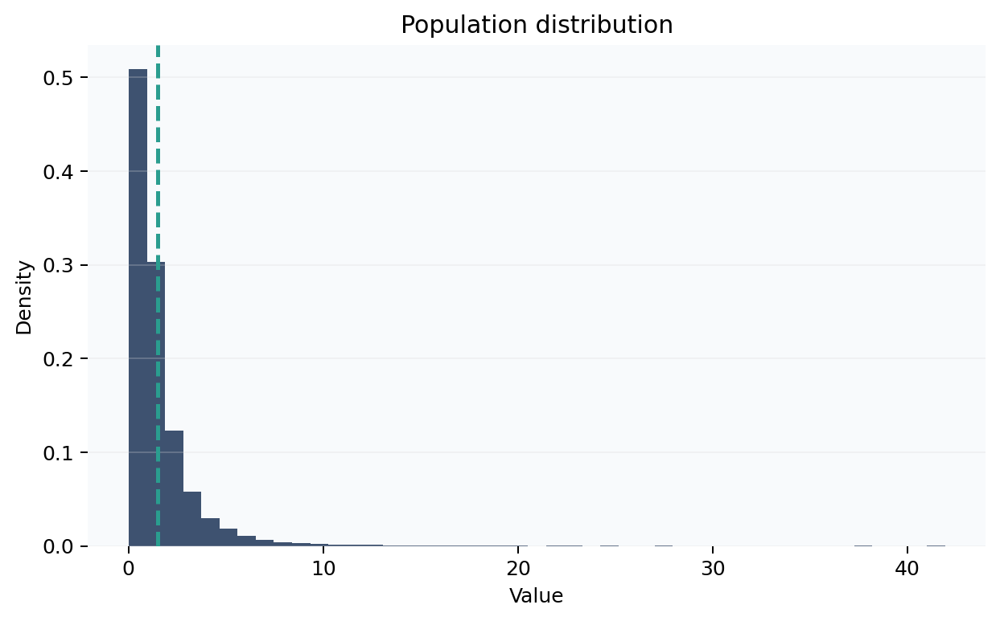
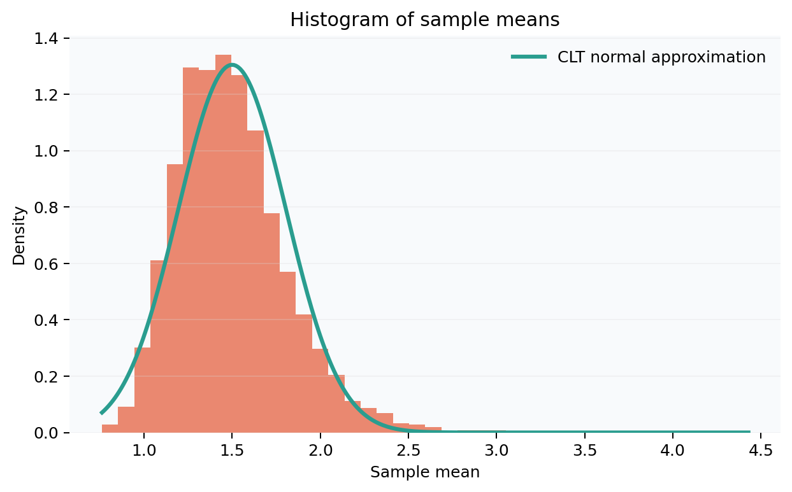
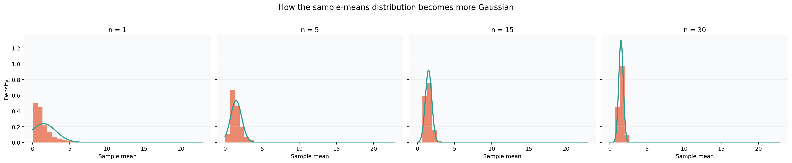

# Central Limit Theorem Playground

A Streamlit app that demonstrates the **Central Limit Theorem (CLT)**: even when the original population is skewed, discrete, or bimodal, the distribution of repeated **sample means** becomes approximately normal as the sample size grows.

## Live deployment

Add your Streamlit Community Cloud URL here after publishing:

[https://share.streamlit.io/your-username/clt-playground/main/app.py](https://share.streamlit.io/your-username/clt-playground/main/app.py)

## What the app demonstrates

The app lets you choose an underlying population distribution and repeatedly draw samples of size `n`. It then shows:

- The original population distribution
- A scatter plot of many repeated sample means
- A histogram of those sample means
- A comparison panel showing how the sample-mean distribution becomes more Gaussian as `n` increases

Included distributions:

- Exponential
- Uniform
- Bernoulli
- Lognormal
- Bimodal Gaussian mixture

## App features

- Sidebar controls for distribution type, parameters, sample size, number of simulations, and random seed
- Optional toggles for raw simulation tables, the sample-means histogram, and theoretical reference values
- Numerical summary cards for population mean, mean of the simulated sample means, empirical standard deviation of the sample means, and theoretical standard error
- A short explanation box and a math explainer section
- A CLT progression panel to make the convergence easier to see visually

## Repo structure

```text
.
|-- app.py
|-- README.md
|-- requirements.txt
|-- .streamlit/
|   `-- config.toml
|-- assets/
|   `-- screenshots/
|-- scripts/
|   `-- generate_readme_assets.py
|-- src/
|   `-- clt_playground/
|       |-- __init__.py
|       |-- core.py
|       `-- plots.py
`-- tests/
    `-- test_core.py
```

## How to run locally

1. Create and activate a virtual environment.
2. Install dependencies:

```bash
pip install -r requirements.txt
```

3. Start the app:

```bash
streamlit run app.py
```

4. Open the local URL shown by Streamlit, usually `http://localhost:8501`.

## Screenshots

### Population distribution



### Histogram of sample means



### CLT progression as sample size increases



## Short explanation of the math

If \(X_1, X_2, \ldots, X_n\) are i.i.d. random variables with mean \(\mu\) and standard deviation \(\sigma\), then the sample mean is

\[
\bar{X}_n = \frac{1}{n}\sum_{i=1}^n X_i.
\]

The Central Limit Theorem says that for large enough \(n\),

\[
\bar{X}_n \approx \mathcal{N}\left(\mu, \frac{\sigma^2}{n}\right).
\]

So even if the original data are skewed or non-normal, the **distribution of sample means** tends toward a normal distribution. The spread of that distribution is the **standard error**:

\[
\text{SE}(\bar{X}_n) = \frac{\sigma}{\sqrt{n}}.
\]

That is why larger sample sizes produce a tighter, more bell-shaped histogram of sample means.

## Streamlit deployment notes

To deploy on Streamlit Community Cloud:

1. Push this repository to GitHub.
2. Go to [Streamlit Community Cloud](https://share.streamlit.io/).
3. Create a new app and point it to `app.py`.
4. After deployment, replace the placeholder link at the top of this README with the real public URL.
